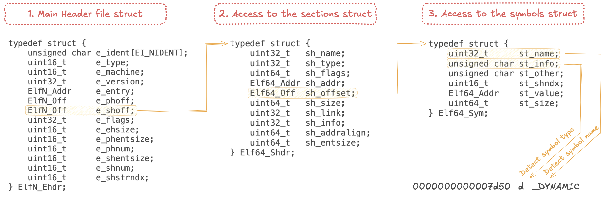

# NM

La commande `nm` liste les symboles d'un fichier objet ou d'un exécutable. Elle est utilisée dans le développement et le débogage de programmes pour analyser les symboles définis et référencés dans un binaire.

## 📌 Fonctionnalités de ft_nm 
- Liste les symboles présents dans un fichier objet(.o), dans une librairie partagée (.so) ou un exécutable.
- Permet de trier et filtrer les symboles selon différents critères (bonus flags -gurp)

## 🔍 Utilisation
La commande `./ft_nm` inspecter le contenu des fichiers objets générés lors de la compilation d'un programme en C ou C++.

Exemple d'utilisation :
```sh
./ft_nm mon_fichier.o
```
Cela affichera une liste des symboles présents dans `mon_fichier.o`, avec leurs adresses et types associés.

## 📂 Interprétation des symboles
Chaque ligne de sortie de `./ft_nm` comporte trois colonnes :
1. **Adresse mémoire** du symbole (ou vide si indéfini)
2. **Type** du symbole (lettre représentant la nature du symbole)
3. **Nom** du symbole

Exemple de sortie :
```
00000000 T main
00000010 T functionA
00000020 D globalVar
         U printf
```

### 📝 Types de symboles

Si la lettre est en minuscule, le symbole est généralement local ; si elle est en majuscule, le symbole est global (externe). 

| **Type** | **Lettre** | **Description** |  
| --- | --- | --- |  
| Symbole absolu | a/A | Adresse fixe indépendante |  
| Données non initialisées | b/B | Variable non initialisée |  
| Symbole commun (petite section) | c/C | Symbole commun dans une section spéciale pour petits objets |  
| Données initialisées | d/D | Variable initialisée |  
| Données en petite section | g/G | Données initialisées pour petits objets |  
| Données en lecture seule | r/R | Variable en lecture seule |  
| Données non initialisées pour petits objets | s/S | Données non initialisées ou zéro-initialisées pour petits objets |  
| Code | t/T | Fonction ou code |  
| Faible local (objet) | v/V | Objet faible local défini |  
| Faible global (non défini) | w/W | Symbole faible non défini |  
| Symbole inconnu | ? | Symbole non reconnu |  

## ⚙️ Comment ça fonctionne ?

- 1️⃣ **Ouvrir le fichier objet**  
- 2️⃣ **Mapper le fichier en mémoire**  
- 3️⃣ **Lire le header ELF** (<u>en-tête contenant des infos sur le fichier, ex: type 32 bits ou 64 bits</u>)  
- 4️⃣ **Lire la table des sections**  
- 5️⃣ **Lire la table des symboles**  
- 6️⃣ **Interpréter et afficher les symboles**  

## 📚 Structure d'un fichier ELF



- **Header ELF** : Contient des informations sur le fichier. Permet d'acceder à la table des sections avec `e_shoff`.
- **Section Table** : Contient les données des section. Permet d'acceder à la table des symbole avec `sh_offset`.
- **Symbol Table** : Contient les données des symboles de la section. (void ci-dessus)

## 🔗 Ressources
- [Page man de nm](https://man7.org/linux/man-pages/man1/nm.1.html)
- [Page man de ELF](https://man7.org/linux/man-pages/man5/elf.5.html)
- [Documentation ELF](https://fr.wikipedia.org/wiki/Executable_and_Linkable_Format)
- [Spécification du format ELF](https://refspecs.linuxbase.org/elf/gabi4+/ch4.symtab.html)
